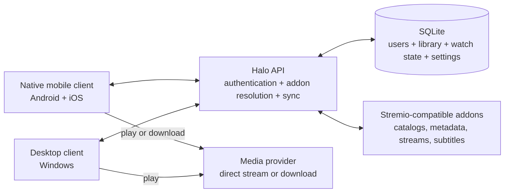

<div align="center">
  

  <h1>Halo</h1>

  <p>
    <strong>A self-hosted media center for discovering, streaming, and downloading movies and series across your devices.</strong>
  </p>

  <p>
    Bring your own Stremio-compatible addons. Halo keeps your library, watch progress, addons, and preferences in sync while media travels directly from your chosen provider to the device.
  </p>

  <p>
    
    
    
    
    
  </p>

  <p>
    <a href="#why-halo">Why Halo</a> ·
    <a href="#features">Features</a> ·
    <a href="#project-status">Project Status</a> ·
    <a href="#architecture">Architecture</a> ·
    <a href="#quick-start">Quick Start</a> ·
    <a href="#client-development">Client Development</a>
  </p>
</div>

> [!IMPORTANT]
> Halo is under active development. The repository contains usable development clients, but it does not currently promise polished installers or a stable public API. The Compose Multiplatform mobile client is replacing the legacy Expo client feature by feature.

## Why Halo

Most media-center clients either depend on someone else's hosted service or make every device keep its own disconnected state. Halo separates those concerns:

- A small self-hosted API owns accounts, addon configuration, library entries, watch progress, and playback preferences.
- Stremio-compatible addons provide catalogs, metadata, streams, and subtitles.
- Device clients play or download the selected provider URL directly. The Halo server does not store media files.

That gives you one private source of truth without turning the server into a bandwidth-heavy media relay.

## Features

- Use existing [Stremio-compatible](https://github.com/Stremio/stremio-addon-sdk/blob/master/docs/protocol.md) catalog, metadata, stream, and subtitle addons.
- Browse movies and series, search across installed catalogs, and choose a source explicitly.
- Synchronize library items, watch progress, addon order, and playback preferences per user.
- Authenticate with Halo-managed local accounts or an external OpenID Connect provider.
- Play through libmpv with audio-track selection, embedded and external subtitles, subtitle styling, resume, and next-episode support.
- Download media to Android or iOS for offline playback, with durable platform-owned background work.
- Adapt the native mobile interface across phones, tablets, portrait, and landscape layouts.
- Keep administrator-managed provider transport URLs out of non-admin responses through opaque addon identifiers.

> [!NOTE]
> Halo does not provide media, debrid access, or addon credentials. Availability and performance depend on the addons and providers you configure.

## Project Status

| Component | Current status | Implementation |
| --- | --- | --- |
| `apps/mobile-native` | Active mobile client rewrite. Browsing, playback, sync, settings, and durable downloads are implemented. | Kotlin Multiplatform, Compose Multiplatform, Ktor, libmpv |
| `apps/desktop` | Functional Windows-first development client with the complete browse-to-playback flow. | Tauri 2, React, TypeScript, Rust, WebView2, libmpv |
| `apps/api` | Self-hosted API with local and OIDC authentication, SQLite persistence, addon resolution, and per-user synchronization. | Node.js 22, Hono, Drizzle ORM, SQLite |
| `apps/mobile` | Legacy iOS client kept fixes-only while the native client reaches parity. | Expo, React Native, libVLC |
| `packages/core` | Shared Stremio protocol types, addon client, subtitle tools, and TypeScript API client. | TypeScript |

Platform floors in the current native configuration are Android 8.0 (API 26) and iOS 15.1. The desktop host is Windows-specific today.

## Architecture



The API resolves installed addons and returns normalized results to authenticated clients. Once a stream is selected, playback and downloads use the provider URL directly. Only account and synchronization data are persisted by Halo.

### Repository layout

```text
apps/api/             Hono API, authentication, SQLite schema, and addon fan-out
apps/desktop/         Windows-first Tauri client with a native mpv host
apps/mobile-native/   Compose Multiplatform client for Android and iOS
apps/mobile/          Legacy Expo iOS client
packages/core/        Shared TypeScript addon and API contracts
Docs/                 Plans, handoffs, and operational investigations
patches/              Reviewed patches for third-party packages
```

## Quick Start

The fastest local path is the Node.js API in local-account mode.

### Requirements

- Node.js 22 or newer
- Corepack, included with Node.js
- Git

### 1. Install dependencies

```powershell
corepack enable
corepack pnpm install --frozen-lockfile
```

### 2. Configure the API

Copy the documented environment template:

```powershell
Copy-Item apps/api/.env.example apps/api/.env
```

For a simple private deployment, edit `apps/api/.env` and select local authentication:

```dotenv
AUTH_MODE=local
ADMIN_PASSWORD=<choose-a-strong-password>
JWT_SECRET=<generate-a-random-secret-of-at-least-32-characters>
DATA_DIR=./data
PORT=8787
```

Do not commit this file. On first boot, Halo creates the local `admin` account from `ADMIN_PASSWORD`. After that, the password can be changed through a client and additional users can be managed by an administrator.

For an existing identity provider, keep `AUTH_MODE=oidc` and configure the issuer, client ID, and administrator group described in [`apps/api/.env.example`](apps/api/.env.example).

### 3. Start the API

```powershell
corepack pnpm --filter @halo/api dev
```

Verify it from another terminal:

```powershell
Invoke-RestMethod http://localhost:8787/health
```

The response should contain `ok: true`.

### Docker

The root `Dockerfile` builds the API only. A standalone container can be started with a persistent SQLite volume:

```powershell
docker build -t halo-api .
docker run --name halo-api --init --restart unless-stopped `
  --env-file apps/api/.env -e DATA_DIR=/data -p 8787:8787 `
  --read-only --tmpfs /tmp:size=64m --cap-drop ALL `
  --security-opt no-new-privileges:true -v halo_data:/data halo-api
```

The checked-in `compose.yaml` is tailored to an existing reverse-proxy deployment and expects an external `terra_edge` network. It is not a zero-configuration local Compose file.

## Client Development

The current desktop and native-mobile clients ask for the Halo server URL on first use. Use `http://localhost:8787` from the Windows desktop client, `http://10.0.2.2:8787` from the standard Android emulator, or the development machine's LAN address from a physical device.

### Android

Requirements:

- Android Studio with Android SDK 36
- JDK 17 or the bundled Android Studio runtime

Build a debug APK on Windows:

```powershell
Set-Location apps/mobile-native
.\gradlew.bat :composeApp:assembleDebug
```

The APK is written to `apps/mobile-native/composeApp/build/outputs/apk/debug/composeApp-debug.apk`.

Release builds intentionally fail unless signing credentials are supplied through local Gradle properties or environment variables. Never commit signing credentials.

### iOS

iOS requires macOS, Xcode, XcodeGen, and the MPVKit layout documented by the native project. The main development flow is:

```bash
cd apps/mobile-native
./gradlew :composeApp:linkDebugFrameworkIosSimulatorArm64
cd iosApp
xcodegen generate
open Halo.xcodeproj
```

See [`apps/mobile-native/README.md`](apps/mobile-native/README.md) for the native architecture, fixture servers, and test-suite requirements.

### Windows desktop

Requirements:

- Node.js 22 and Corepack
- Rust stable toolchain
- Microsoft C++ Build Tools and WebView2
- The LGPL `libmpv-2.dll` described in [`apps/desktop/vendor/README.md`](apps/desktop/vendor/README.md)

Place the libmpv DLL in the documented vendor directory, then run:

```powershell
corepack pnpm --filter @halo/desktop dev
```

The desktop app uses a Tauri/WebView2 interface over a Rust-owned native mpv playback surface. It is not Electron, and media decoding does not happen inside the webview.

## Development Checks

TypeScript workspace:

```powershell
corepack pnpm -r typecheck
corepack pnpm --filter @halo/api test
```

Native mobile project on Windows:

```powershell
Set-Location apps/mobile-native
.\gradlew.bat :composeApp:compileCommonMainKotlinMetadata
.\gradlew.bat :composeApp:compileTestKotlinIosSimulatorArm64
python -m unittest discover -s fixtures/tests -v
```

Apple framework, host-bridge, and XCUITest verification require macOS or an iOS CI runner.

## Additional Documentation

- [`apps/mobile-native/README.md`](apps/mobile-native/README.md): native client architecture and platform verification
- [`apps/mobile-native/fixtures/README.md`](apps/mobile-native/fixtures/README.md): local authentication and ranged-media fixtures
- [`Docs/PLAN.md`](Docs/PLAN.md): current implementation plan and remaining platform work
- [`Docs/providerissues.md`](Docs/providerissues.md): investigation of intermittent stream-provider failures

## Scope and Content

Halo is a client and synchronization service. It does not bundle content, host media, include a torrent engine, or grant access to third-party services. You are responsible for the addons and providers you configure and for following their terms and applicable law.
